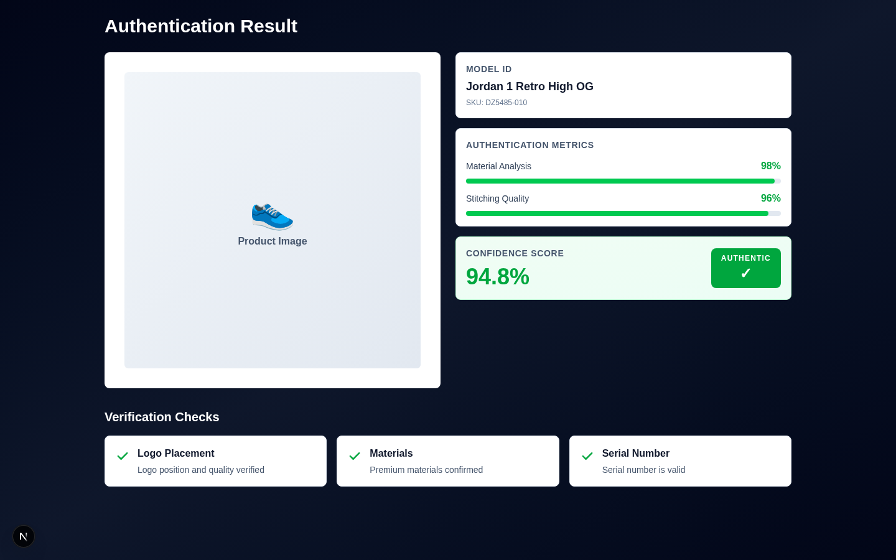
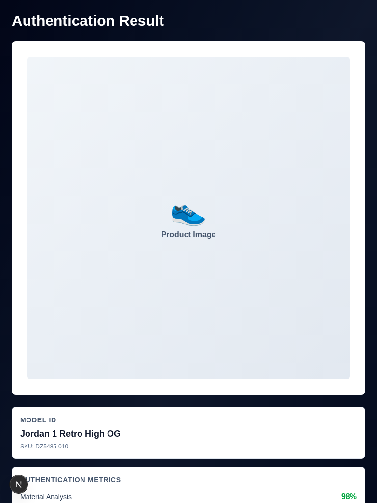
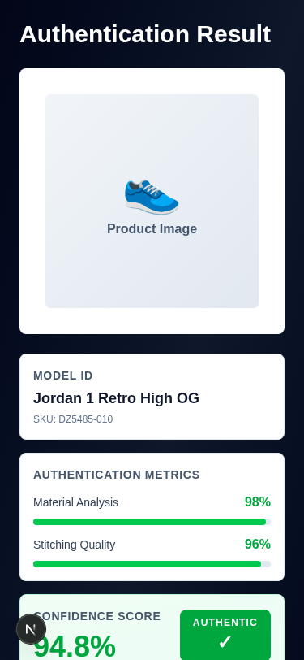

# SneakersLite — Professional Product Authentication Dashboard

A clean, modern Next.js dashboard for sneaker product authentication results. Built with TypeScript, Tailwind CSS, and optimized for both desktop and mobile experiences.

## 🎯 Features

- **Clean, Professional Design** — Minimalist UI with dark theme and green accent colors for authentication status
- **Responsive Layout** — Works seamlessly on desktop, tablet, and mobile devices
- **Two-Column Dashboard** — Product image showcase alongside detailed metrics
- **Real-Time Metrics** — Material analysis, stitching quality, and confidence scoring
- **Authentication Badge** — Clear visual indication of product authenticity
- **Verification Checks** — Easy-to-scan verification results with checkmark icons

## 📱 Screenshots

### Desktop (1440x900)


### Tablet (768x1024)


### Mobile (375x812)


## 🛠️ Tech Stack

- **Framework:** Next.js 16.1.6 (with Turbopack)
- **Language:** TypeScript
- **Styling:** Tailwind CSS
- **Build Tool:** NPM

## 🚀 Quick Start

### Installation

```bash
npm install
```

### Development

```bash
npm run dev
```

Open [http://localhost:3000/dashboard-demo](http://localhost:3000/dashboard-demo) in your browser.

### Production Build

```bash
npm run build
npm start
```

## 📁 Project Structure

```
├── app/
│   ├── dashboard-demo/    # Main dashboard component
│   ├── layout.tsx         # Root layout (clean, no header/footer)
│   ├── page.tsx          # Home page
│   └── globals.css       # Tailwind configuration
├── public/
│   └── screenshots/      # Dashboard screenshots
├── package.json
└── tsconfig.json
```

## 🎨 Design Highlights

### Color Palette
- **Background:** Deep slate/navy gradient (`from-slate-950 to-slate-950`)
- **Cards:** Clean white with subtle slate borders
- **Accent:** Green for positive authentication results (`text-green-600`)
- **Typography:** Bold headings, readable body text with high contrast

### Layout Strategy
- **No Header/Footer** — Full focus on dashboard content
- **Tight Container** — Minimal padding/margins for professional appearance
- **Grid-Based** — Responsive grid system for adaptive layouts
- **Shadow & Depth** — Subtle shadows for visual hierarchy

## 🔍 Authentication Metrics

The dashboard displays:

1. **Model ID** — Product name and SKU
2. **Authentication Metrics** — Material analysis and stitching quality with progress bars
3. **Confidence Score** — Final authenticity percentage with status badge
4. **Verification Checks** — Three key validation points (Logo Placement, Materials, Serial Number)

## 📦 Deployment

This project is optimized for Vercel deployment:

```bash
vercel deploy
```

**Environment:** Production-ready with static page pre-rendering.

## 📄 License

© 2026 Novelship. All rights reserved.

---

**Built with ❤️ for sneaker authentication excellence.**
